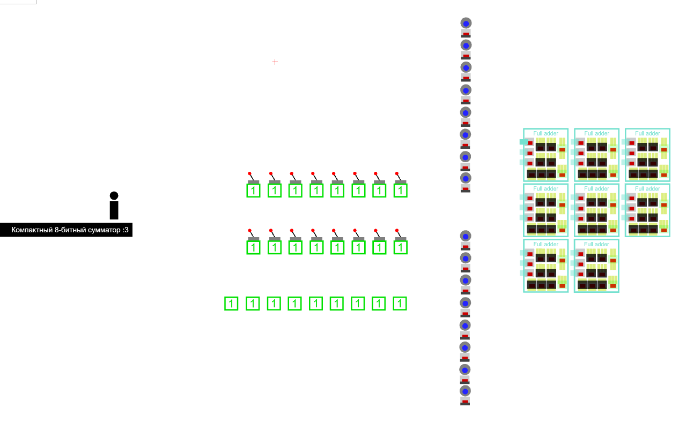
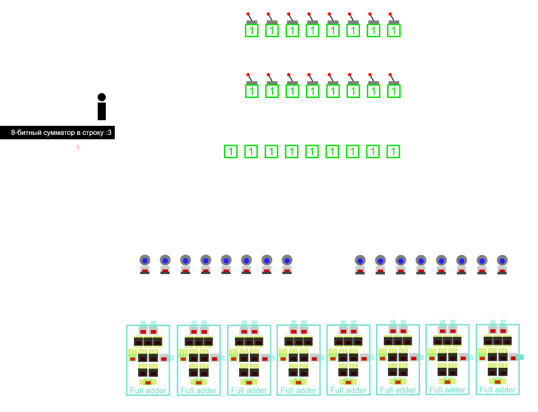
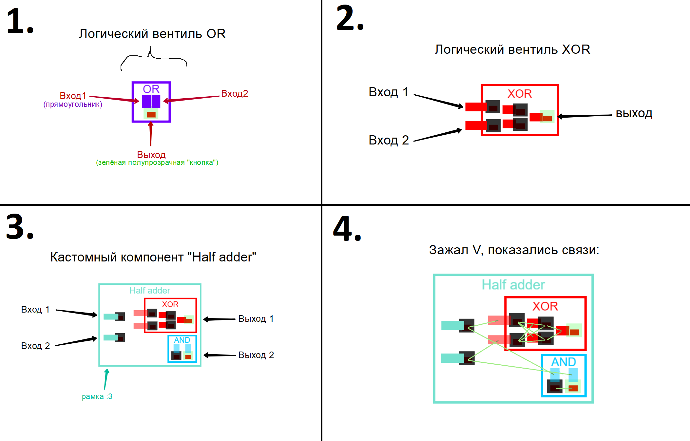
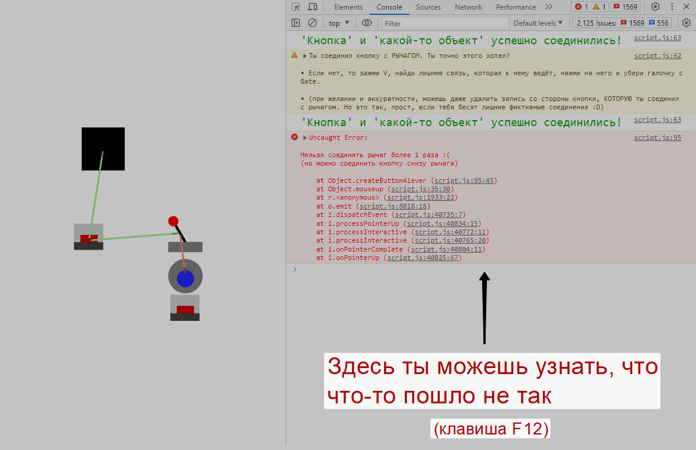
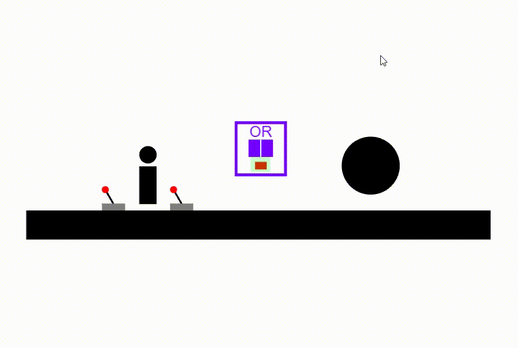
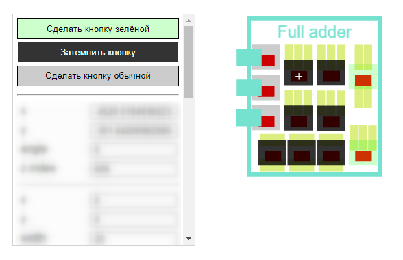
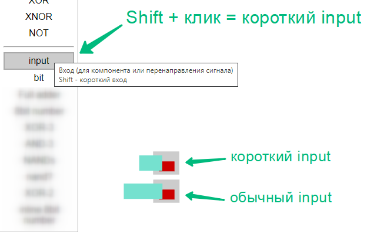
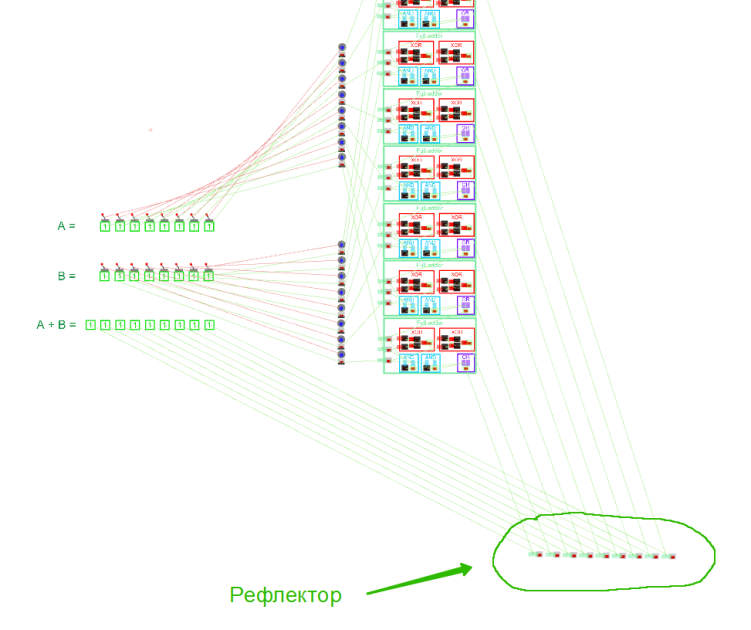

## Содержание
- [О проекте 🔥](#about)
- [Глоссарий](#glossary)
- [Горячие клавиши ❗](#hotkeys)
- [Как правильно соединять ❓](#how2connect)
- [Как создать кастомный компонент ❓](#customComponent)
- [Интересности ❗](#interesting)

# О проекте 🔥
Чтобы сделать Брофист тьюринг-полным, я внёс два простых изменения:
1. Скрытая кнопка не может быть нажата
2. Гейт может нажать кнопку

Кажется, это необходимые и достаточные условия... 🤔

▶️ Поиграть можно тут: https://h336.github.io/Brofist-io-editor/

	
Также тут есть другие карты...

- [Компактный дизайн 8-битного сумматора](https://h336.github.io/Brofist-io-editor/?map=8bitAdder-compact)

- [Инлайновый дизайн 8-битного сумматора](https://h336.github.io/Brofist-io-editor/?map=8bitAdder-inline)

## Глоссарий
- ### Входы - прямоугольники (см. картинку ниже)
- ### Выходы - зелёные кнопки

- ### Кастомный компонент - содержит другие компоненты
- ### Вентиль - один из базовых компонентов (OR,AND,NOR,NAND,XOR,XNOR,NOT, input,bit)
- ### Рамка - окаймление компонента вместе с его названием

- ### Соединения (связи) - показываются зелёными ниточками

	
Спойлер про связи...

- 🟩 зелёные связи - между кнопкой и гейтом
- 🟥 красные связи - между рычагом и платформой
- 🟦 синие связи - между платформой хендлом

## Горячие клавиши ❗
- **0-9** - выбор объекта в боковой панельке (курсор, блок, круг, ...)
- **P** - начать играть
- **Esc** - закрыть игру

- Зажать **V** - просмотр соединений кнопок, рычагов и платформ
- **C** - перекрасить выбранный вход/рамку в цвет кнопки справа снизу / **Shift+C** - загрузить в кнопку цвет выбранного объекта

- Выделить область (и не отпуская мышь!) нажать **F** - создание рамки (для компонента) / **Shift+F** - дополнительные параметры (толщина рамки, размер шрифта, местоположение названия)
- Выделить область (с компонентом) и нажать **S** - сохранение
- Выделить область и нажать **D** - удаление

## Как правильно соединять ❓
> **НАСТОЯТЕЛЬНО РЕКОМЕНДУЮ СИДЕТЬ ТАМ С ОТКРЫТОЙ КОНСОЛЬЮ DEVTOOLS, ПОТОМУ ЧТО ЕСЛИ ТЫ СЛУЧАЙНО ЧТО-ТО ПЕРЕПУТАЕШЬ, КОНСОЛЬ ОБРАТИТ НА ЭТО ТВОЁ ВНИМАНИЕ!!!**
> 

Пользователю удобнее будет взаимодействовать только с рычагами. Они активируют кнопки, которые будут слать сигнал в схему. Схема на выходе может показать какой-нибудь объект.
Соединять можно ТОЛЬКО <ins>зажимая колесо мыши</ins> и перетаскивая её от одного объекта к другому.

- Нажать на рычаг один раз (КОЛЕСОМ МЫШИ!) - под ним создастся кнопка (с ней и будут идти дальнейшие взаимодействия).

- Перетащить от кнопки к входу (т.е. зажать колесо мыши на кнопке, потащить, а отпустить на входе) - связать их (т.е. когда будет нажиматься кнопка, будет активироваться вход). Вход при этом должен стать полупрозрачным
- Перетащить от выхода к объекту - связать их (и когда на выходе будет сигнал=1, объект покажется)
- Также можно перетаскивать от выхода одного вентиля к входу другого!

	
Кстати...

	На гифке выше я сначала нажимал на рычаг, а потом соединял кнопку ниже, но на самом деле можно соединить рычаг с входом напрямую (кнопка создастся автоматически)! Но только один раз :D

## Как создать кастомный компонент ❓
Если ты создал небольшую схемку и хочешь её переиспользовать - объедини её в кастомный компонент.
> **ПРОСТО КОПИРОВАТЬ КОМПОНЕНТЫ (Ctrl+C,Ctrl+V) КАТЕГОРИЧЕСКИ НЕЛЬЗЯ (иначе они будут неправильно работать)!!!**
1. Отойди в свободное пространство и создай входов сколько нужно (кнопка input в боковой панельке)
2. Правее **С НУЛЯ** расставь все нужные "внутренности" твоего компонента (их можно найти в боковой панельке) - именно С НУЛЯ, потому что после копирования/перемещения уже использованных компонентов ты можешь не заметить скрытые мешающие связи (уж лучше сделать с нуля, чем потом три часа разбираться что могло пойти не так)
3. Соедини свою схему нужным образом (относись к кнопкам от input'ов как к обычным кнопкам под рычагами)

4. Выдели всю схему и, не отпуская ЛКМ, нажми **F**. В окошко "Название компонента" впиши название и нажми Enter. Под схемой появится РАМКА с названием.
5. Выдели всю схему вновь, включая рамку (кстати, удобно то, что после нажатия Enter прямоугольник выделения никуда не пропадёт!), отпусти ЛКМ и нажми **S**
6. 👏 ГОТОВО. Твой компонент появится в боковой панельке, теперь можешь его использовать много раз :3

### Желательно придерживаться такой методологии:
- ⬜ Светлые кнопки - входы компонента
- ⬛️ Тёмные кнопки - его внутренние кнопки
- 🟩 Зелёные кнопки - его выходы

### Кстати, если зажать Shift и кликнуть на компонент input, он будет коротким! :D

## Интересности ❗
### Рефлектор - ряд input'ов для перенаправления сигнала

Свою схему нужно держать в интуитивно понятной чистоте, и иногда для этого нужен **РЕФЛЕКТОР**.

(если бы на этой схеме не было рефлектора, ты бы просто запутался во всех этих пересекающихся связях 😐)

